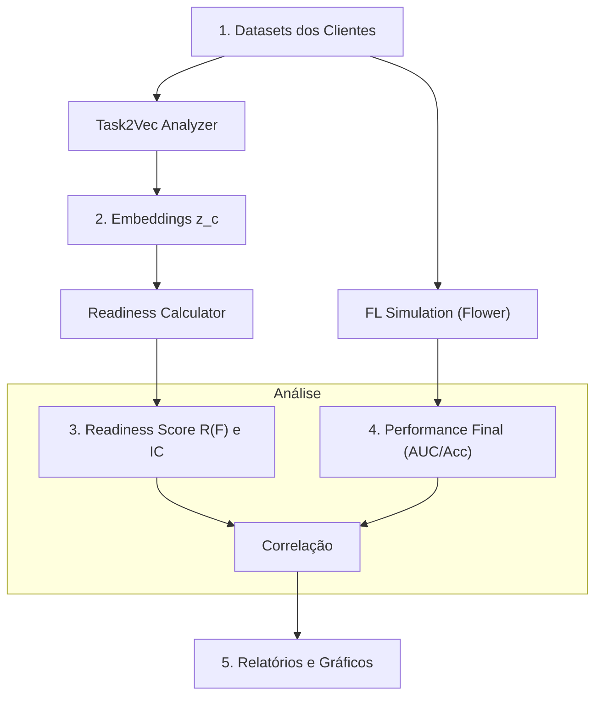

# Task2Vec Readiness: Um Framework de Diagnóstico Pré-Treino para Aprendizado Federado


Este repositório contém o código para o projeto "Task2Vec Readiness", uma estrutura para prever o desempenho do Aprendizado Federado (FL) antes do início do custoso processo de treinamento. O objetivo principal é fornecer uma ferramenta de diagnóstico que ajude pesquisadores e praticantes a entender e otimizar a dinâmica de treinamento distribuído em cenários com dados heterogêneos.

---

## 📖 Índice

* [Visão Geral](#-visão-geral)
* [O Conceito: Índice de Readiness (R(F))](#-o-conceito-índice-de-readiness-rf)
* [Recursos Principais](#-recursos-principais)
* [Como Funciona](#-como-funciona)
* [Estrutura do Repositório](#-estrutura-do-repositório)
* [Instalação e Configuração](#-instalação-e-configuração)
* [Como Executar os Experimentos](#-como-executar-os-experimentos)
* [Resultados](#-resultados)
* [Como Citar](#-como-citar)
* [Licença](#-licença)

---

## 🔭 Visão Geral

O desempenho do Aprendizado Federado (FL) é notoriamente sensível à heterogeneidade dos dados dos clientes (não-IID), ao desbalanceamento e ao tamanho da federação. Atualmente, a falta de ferramentas de diagnóstico pré-treino força uma abordagem de tentativa e erro, que é cara e demorada.

Este projeto introduz um **Índice de Readiness (R(F))** que quantifica a "prontidão" de uma determinada federação para o treinamento colaborativo. Utilizando embeddings **Task2Vec**, transformamos a distribuição de dados de cada cliente em um vetor de características e, a partir deles, calculamos métricas não supervisionadas que descrevem a estrutura da federação. A nossa hipótese, validada experimentalmente, é que um R(F) mais alto correlaciona fortemente com um melhor desempenho final do modelo global (Acurácia/AUC).

## 💡 O Conceito: Índice de Readiness R(F)

O `R(F)` é um score calculado a partir de um conjunto de embeddings de clientes `{z_c}`. Cada `z_c` é um vetor que representa a "tarefa" de aprendizado de um cliente, extraído via geometria da Informação de Fisher. O índice agrega várias métricas estruturais:

* **Coesão:** A similaridade média entre as tarefas dos clientes. Federações coesas tendem a convergir melhor.
* **Dispersão:** A variabilidade ou distância média das tarefas em relação ao centroide da federação.
* **Cobertura de Classes:** A proporção de classes do problema global que estão representadas na federação.
* **Entropia:** A incerteza ou diversidade média na distribuição de dados de cada cliente.
* **Tamanho Efetivo:** Uma medida do total de dados disponíveis na federação.

## ✨ Recursos Principais

* **Extração de Embeddings:** Módulo para calcular embeddings Task2Vec para qualquer dataset PyTorch.
* **Cálculo de Readiness:** Implementação de múltiplas variantes do índice R(F) com cálculo de intervalo de confiança via bootstrap.
* **Simulação de FL:** Orquestração de simulações de Aprendizado Federado de ponta a ponta usando o framework [Flower](https://flower.dev/).
* **Análise de Correlação:** Scripts para gerar relatórios e gráficos que correlacionam o R(F) com o desempenho final.
* **Configuração Flexível:** Os experimentos são totalmente controlados via um único arquivo `config.yaml`.
* **Suporte a Datasets:** Facilmente extensível para novos datasets (CIFAR-10, FEMNIST e a suíte MedMNIST já estão integrados).

## ⚙️ Como Funciona

O fluxo de trabalho do framework pode ser resumido no seguinte diagrama:



## 📁 Estrutura do Repositório

```
.
├── config/
│   └── config.yaml             # Arquivo de configuração principal
├── src/
│   ├── main.py                 # Ponto de entrada para orquestrar os experimentos
│   ├── fl_simulation.py        # Lógica para simulação de FL com Flower
│   ├── task2vec_analysis.py    # Lógica para extração de embeddings e cálculo do R(F)
│   ├── data_utils.py           # Funções para download e particionamento dos datasets
│   ├── models.py               # Definições dos modelos (ex: ResNet34)
│   └── utils.py                # Funções utilitárias (logging, seeds, etc.)
├── requirements.txt            # Dependências do projeto
└── results/                    # Diretório para salvar os outputs (CSVs, gráficos, logs)

```

## 🚀 Instalação e Configuração

**1. Clone o repositório:**
```bash
git clone https://github.com/CristianoMafuz/task2vec_federated_learning.git
cd task2vec_federated_learning
```

**2. Crie um ambiente virtual (recomendado):**
```bash
# Usando venv
python -m venv venv
source venv/bin/activate

# Ou usando Conda
conda create -n task2vec_fl python=3.9
conda activate task2vec_fl
```

**3. Instale as dependências:**
```bash
pip install -r requirements.txt
```
*(Nota: Certifique-se de que o `requirements.txt` contém todas as bibliotecas necessárias, como `torch`, `torchvision`, `flwr`, `task2vec`, `pandas`, `scikit-learn`, `seaborn`, `pyyaml`)*.

**4. Download dos Datasets:**
A primeira execução do código tentará baixar os datasets automaticamente. Para os datasets MedMNIST, pode ser necessário baixá-los manualmente caso a conexão falhe, e colocá-los no diretório de dados especificado.

## ⚡ Como Executar os Experimentos

Todos os experimentos são controlados pelo arquivo `config.yaml`.

**1. Configure seu experimento:**
Abra o `config.yaml` e ajuste os parâmetros conforme necessário.

```yaml
experiment:
  name: "Readiness_vs_Alpha_CIFAR10"
  seed: 42
  output_dir: "results"
  num_independent_federations: 5 # Quantas vezes repetir cada configuração

datasets:
  - name: "cifar10"
    target_metric: "accuracy"
    target_threshold: 0.6
  - name: "pathmnist"
    target_metric: "auc_macro"
    target_threshold: 0.85

federation:
  num_clients: [10, 20] # Lista de tamanhos de federação a testar
  alpha_values: [0.1, 0.5, 1.0] # Lista de valores de alpha (heterogeneidade)

fl_training:
  num_rounds: 50
  epochs_per_round: 3
  # ... outros hiperparâmetros de FL

readiness:
  variants: ["cohesion_dispersion"] # Variantes de R(F) a serem calculadas
```

**2. Execute os experimentos:**
Para executar a suíte completa de experimentos definida no `config.yaml`:
```bash
python main.py --config config.yaml
```

**3. Execute um teste rápido:**
Para validar a instalação e o fluxo, execute o modo de teste, que usa uma configuração mínima:
```bash
python main.py --test
```

Os resultados, incluindo um arquivo `results.csv` consolidado, logs e gráficos, serão salvos no diretório de saída definido.

## 📊 Resultados

Nossos experimentos demonstram uma forte correlação positiva entre o Índice de Readiness (calculado antes do treino) e o desempenho final do modelo global. Abaixo, um exemplo da correlação observada para o dataset PathMNIST com 10 clientes, variando o nível de heterogeneidade (alpha).

*Exemplo: Gráfico de Dispersão de R(F) vs. AUC Final no PathMNIST*
+vs.+AUC)

A tabela abaixo resume os resultados, mostrando que valores mais altos de `readiness` (associados a `alpha` maiores e, portanto, dados mais IID) levam a um `final_auc_macro` maior.

| dataset   | alpha | readiness | final_auc_macro |
|-----------|-------|-----------|-----------------|
| pathmnist | 0.05  | 0.731     | 0.873           |
| pathmnist | 0.2   | 0.865     | 0.943           |
| pathmnist | 1.0   | 0.956     | 0.958           |
| pathmnist | 5.0   | 0.970     | 0.956           |

## 🎓 Como Citar

Se você utilizar este código ou a metodologia em sua pesquisa, por favor, cite nosso trabalho.
```bibtex
@article{Mafuz_2025_task2vec,
  title   = {Task2Vec Readiness: A Pre-Training Diagnostic Framework for Federated Learning},
  author  = {Cristiano Augusto Dias Mafuz and Rodrigo César Pedrosa Silva},
  journal = {Pré-publicação ou Conferência},
  year    = {2025}
}
```

## 📜 Licença

Este projeto é licenciado sob a Licença MIT. Veja o arquivo [LICENSE](LICENSE) para mais detalhes.
